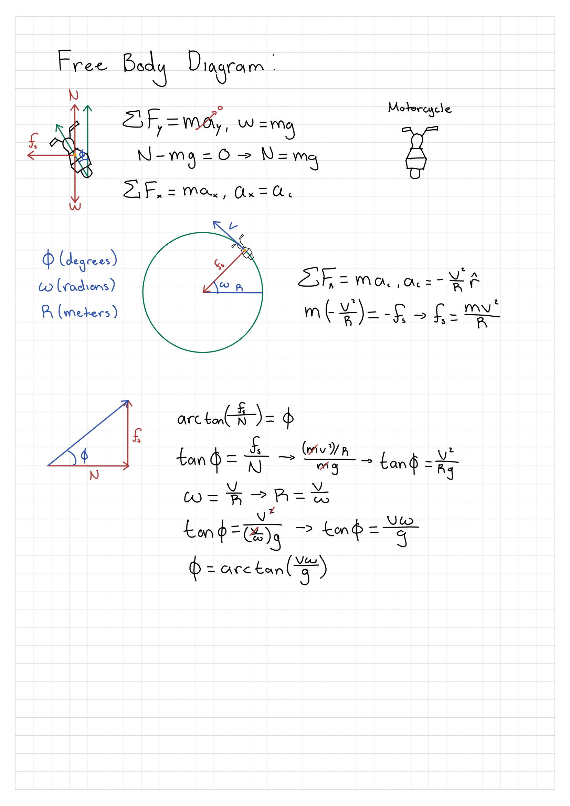

# Lean Angle Physics

This document derives the lean angle equation used in this project and explains
why we can't just get the lean angle reading from the accelerometer.

## Problem

Usually, to get the tilt from an IMU you use atan(*a_y*, *a_z*) which is the angle of the
gravity vector in the sensors own frame. During a turn on a motorcycle however, this equation
returns approximately zero regardless of the true lean angle.

An accelerometer measures *proper acceleration*: the non-gravitational force per unit acting on
it. As a result of it being mounted onto the bike, it measures the contact force from the road.
In a steady-state balanced turn, that force points directly along the bike's own vertical axis
(which is the sensor's z-axis). All of the measured forces lands on *a_z*, none on *a_y*, and the
arctangent of zero over anything is zero.

## Free Body Diagram

Image Description:
- The first FBD is a rear view perspective as the bike rides away.
- The second FBD is a sky view perspective as the bike rides along the path of the circle.
- Labeled Axis FBD 1: (*x-axis* = forward/backward, *y-axis* = left/right, *z-axis* = up/down).
- Labeled Axis FBD 2: (*r-axis* = radially inward/backward).
- Variables: $\varphi$ (deg), $\omega$ (rad), $R$ (m), $v$ (m/s), $g$ (m/s^2). 

Forces:
- $N$: normal force, perpendicular to the ground.
- $f_s$: static friction, horizontal at the contact patch, points radially inward.
- $W$: weight, points down at the center of gravity

## The Balance Condition

In a steady turn $\varphi$ is constant, so there is no angular acceleration, so the net torque
about the center of gravity is zero.

The CG is the pivot of choice here because the bike is centripettally accelerating, and $\tau = I\alpha$
holds cleanly only about the center of mass. Gravity actsat the CG, therefore it has zero lever arm about it.

That leaves only the contact force. For it to produce zero torque about the CG, its line of action must pass
through the CG so the resultant of $N$ and $f_s$ point straight up the bike's tilted axis. At angle $\varphi$
from vertical.

## Derivation

The resultant makes angle $\varphi$ with respect to the vertical, and its components are $f_s$ horizontal over
$N$ vertical:

$$\tan\varphi = \frac{f_s}{N} = \frac{mv^2/R}{mg} = \frac{v^2}{Rg}$$

Mass cancels, lean angle is independent of the weight of bike and rider.

Radius is not directly measurable, but yaw rate is. Since $\omega = v/R$, substituting $R = v/\omega$ gives

$$\tan\varphi = \frac{v^2}{(v/\omega)g} = \frac{v\omega}{g}$$

$$\boxed{\varphi = \arctan\left(\frac{v\omega}{g}\right)}$$

This requires only ground speed (from the GPS) and the yaw rate (from the gyroscope). The accelerometer is not
needed at all.

## Sanity Check

Standstill: 
$v = 0 \Rightarrow \varphi = \arctan(0) = 0$. Upright.

Typical Corner:
$v = 15$ m/s, $\omega = 0.4$ rad/s. 

$$\varphi = \arctan\left(\frac{15 \times 0.4}{9.81}\right) = \arctan(0.61) \approx 31°$$

## Assumptions and Limitations

- **Balanced turn, no sideslip.** The derivation assumes the bike is neither falling in nor standing up,
  and that the tires are not sliding.
- **Body-frame yaw rate.** The gyro measures $\omega$ in the body frame, not the earth frame. These differ
  in a leaned turn by a factor involving $\cos\varphi$; the error grows with lean angle.
- **GPS speed accuracy.** Degrades under poor sky view, which propagates directly into the estimate.
- **Sensor mounted on the swingarm, not the frame.** On this bike the rear fender moves with the rear suspension,
  so the sensor sees suspension motion and additional vertical vibration. Roll is unaffected, since the swingarm
  rolls with the bike.